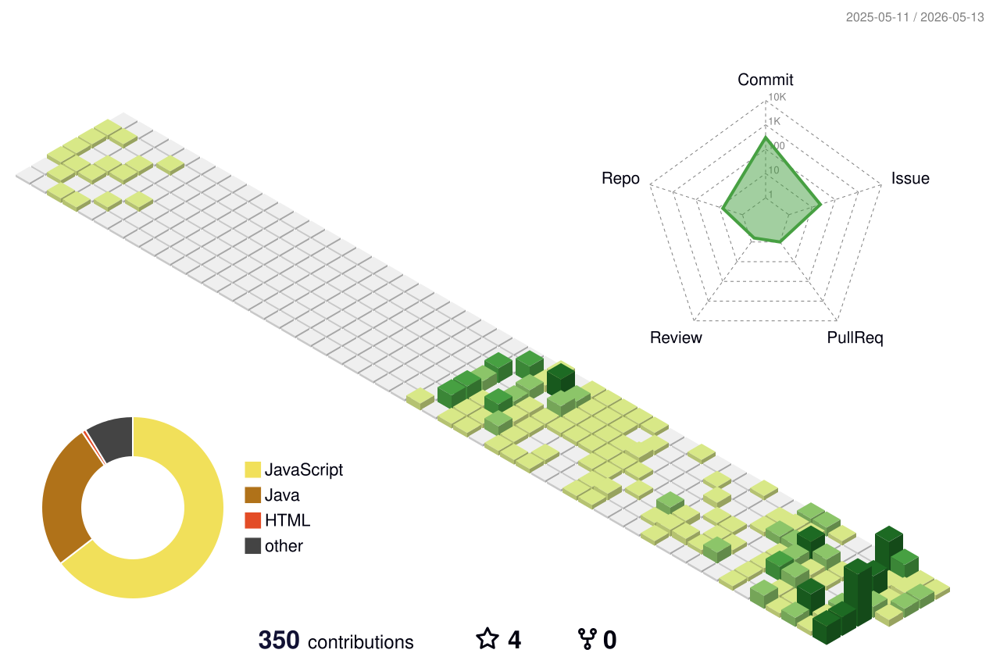

# BuildEnough

Java / Spring 기반 웹 백엔드 개발을 중심으로 공부하고 프로젝트를 만들고 있습니다.  
단순히 기능을 붙이는 것보다, 데이터 흐름, DB 설계, 비즈니스 로직, 사용자 흐름을 이해하면서 실제로 동작하는 서비스를 만드는 데 관심이 있습니다.

---

## Main Stack

---

## Experience / Studying

---

## Study Notes

| 분류 | 바로가기 | 설명 |
|------|----------|------|
| Java | [java](https://github.com/BuildEnough/study/tree/master/java) | Java 문법, 객체지향, 예외처리, 컬렉션, 스레드 등 |
| Python | [python](https://github.com/BuildEnough/study/tree/master/python) | Python 기초 문법, 함수, 클래스, 예외처리, 내장함수 등 |
| JavaScript | [javascript](https://github.com/BuildEnough/study/tree/master/javascript) | JavaScript 기초 문법 및 브라우저 예제 |
| Spring | [spring](https://github.com/BuildEnough/study/tree/master/spring) | Spring 관련 학습 및 프로젝트 정리 |
| Android | [android](https://github.com/BuildEnough/study/tree/master/android) | Android 실습 및 프로젝트 정리 |
| Django | [Django](https://github.com/BuildEnough/study/tree/master/Django) | Django 학습 내용 정리 |
| React | [react](https://github.com/BuildEnough/study/tree/master/react) | React 프로젝트 및 학습 정리 |
| Git | [git](https://github.com/BuildEnough/study/tree/master/git) | Git, GitHub, 브랜치 전략, 협업 방식 정리 |
| DB | [DB](https://github.com/BuildEnough/study/tree/master/DB) | 데이터베이스 개념, 실습, 환경 설정 정리 |
| HTML / CSS | [htmlCss](https://github.com/BuildEnough/study/tree/master/htmlCss) | HTML, CSS 실습 예제 정리 |
| Computer Science | [ComputerScience](https://github.com/BuildEnough/study/tree/master/ComputerScience) | 네트워크, 운영체제, 자료구조, 웹, 백엔드 등 |
| Edu | [edu](https://github.com/BuildEnough/study/tree/master/edu) | 수업, 실습, 과제, 학습 자료 정리 |

---

## GitHub Activity

