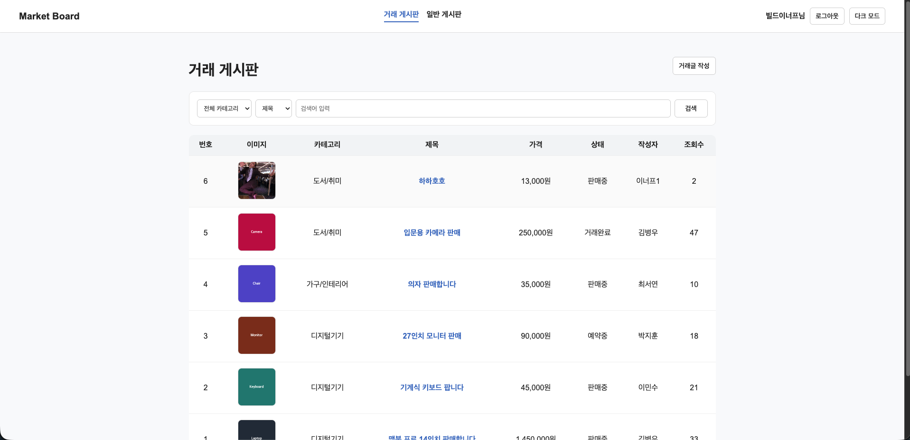
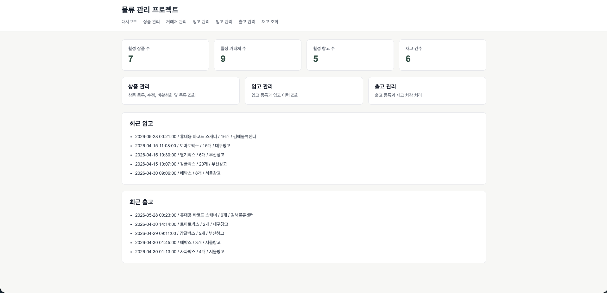
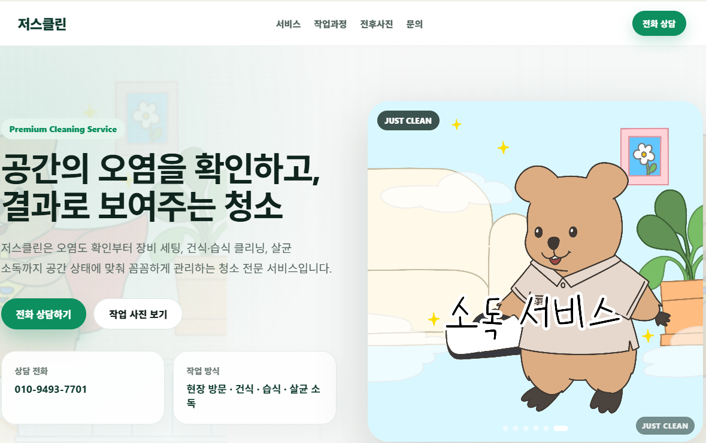

# BuildEnough

Java / Spring 기반 웹 백엔드 개발을 중심으로 공부하고 프로젝트를 만들고 있습니다.  
단순히 기능을 붙이는 것보다, **데이터 흐름**, **DB 설계**, **비즈니스 로직**, **사용자 흐름**을 이해하면서 실제로 동작하는 서비스를 만드는 데 관심이 있습니다.

---

## About Me

- Java, Spring Boot, MyBatis, MySQL 기반 웹 애플리케이션을 주로 학습하고 있습니다.
- 게시판, 중고 거래, 물류 관리처럼 CRUD와 데이터 흐름이 분명한 프로젝트를 직접 구현하고 있습니다.
- ERD 설계, 예외 처리, 검색/페이징, 파일 업로드, 권한 처리 같은 백엔드 기본기를 프로젝트에 적용해보고 있습니다.
- 학습한 내용은 `study` 저장소에 주제별로 정리하고 있습니다.

---

## Main Stack

### Experience / Studying

---

## Featured Projects

### 중고 거래 게시판

Spring Boot와 MyBatis를 기반으로 일반 게시판과 중고 거래 게시판을 구현한 웹 프로젝트입니다.  
기본 게시판 기능에서 시작해 거래 게시판, 이미지 업로드, 찜, 거래 상태, React 화면까지 확장했습니다.

- 주요 기능: 회원가입/로그인, 게시글 CRUD, 댓글, 좋아요, 검색, 페이징, 거래글 이미지 업로드, 찜, 거래 상태 관리
- Backend: Java 21, Spring Boot, MyBatis, MySQL, Validation, Lombok
- Frontend: Thymeleaf, HTML, CSS, JavaScript, React, Vite
- [Demo](http://board.buildenough.shop) / [Repository](https://github.com/BuildEnough/market-board)

---

### 물류 관리 프로젝트

상품, 거래처, 창고를 기준정보로 관리하고 입고/출고 이력을 통해 재고를 반영하는 물류 관리 프로젝트입니다.  
ERD 설계부터 시작해 입고 시 재고 증가, 출고 시 재고 감소, 재고 부족 시 출고 차단 흐름을 구현했습니다.

- 주요 기능: 상품/거래처/창고 관리, 입고 등록, 출고 등록, 재고 조회, 재고 부족 예외 처리, 기준정보 비활성화 처리
- Backend: Java 21, Spring Boot, MyBatis, MySQL, Validation, Lombok
- Frontend: HTML, CSS, JavaScript
- [Demo](http://buildenough.shop) / [Repository](https://github.com/BuildEnough/mark2_logistics)

---

### 저스클린 랜딩페이지

실제 청소업체를 소개하고 상담 연결까지 이어질 수 있도록 만든 React 기반 랜딩페이지입니다.  
업체 소개, 서비스 안내, 작업 과정, Before/After 사진, 상담 버튼을 중심으로 구성했습니다.

- 주요 기능: 메인 이미지 슬라이드, 서비스 카드, 작업 과정 안내, 작업 전후 사진, 공식 채널 연결, 상담 버튼
- Frontend: React, Vite, JavaScript, CSS
- Deploy: GitHub Pages, GitHub Actions
- [Demo](https://buildenough.github.io/justclean/#home) / [Repository](https://github.com/BuildEnough/justclean)

---

## Study Notes

| 분류 | 바로가기 | 설명 |
|------|----------|------|
| Java | [java](https://github.com/BuildEnough/study/tree/master/java) | Java 문법, 객체지향, 예외처리, 컬렉션, 스레드 등 |
| Python | [python](https://github.com/BuildEnough/study/tree/master/python) | Python 기초 문법, 함수, 클래스, 예외처리, 내장함수 등 |
| JavaScript | [javascript](https://github.com/BuildEnough/study/tree/master/javascript) | JavaScript 기초 문법 및 브라우저 예제 |
| Spring | [spring](https://github.com/BuildEnough/study/tree/master/spring) | Spring 관련 학습 및 프로젝트 정리 |
| Android | [android](https://github.com/BuildEnough/study/tree/master/android) | Android 실습 및 프로젝트 정리 |
| Django | [Django](https://github.com/BuildEnough/study/tree/master/Django) | Django 학습 내용 정리 |
| React | [react](https://github.com/BuildEnough/study/tree/master/react) | React 프로젝트 및 학습 정리 |
| Git | [git](https://github.com/BuildEnough/study/tree/master/git) | Git, GitHub, 브랜치 전략, 협업 방식 정리 |
| DB | [DB](https://github.com/BuildEnough/study/tree/master/DB) | 데이터베이스 개념, 실습, 환경 설정 정리 |
| HTML / CSS | [htmlCss](https://github.com/BuildEnough/study/tree/master/htmlCss) | HTML, CSS 실습 예제 정리 |
| Computer Science | [ComputerScience](https://github.com/BuildEnough/study/tree/master/ComputerScience) | 네트워크, 운영체제, 자료구조, 웹, 백엔드 등 |
| Edu | [edu](https://github.com/BuildEnough/study/tree/master/edu) | 수업, 실습, 과제, 학습 자료 정리 |

---

## GitHub Activity

> 3D contribution graph는 필요할 때 수동으로 업데이트합니다.

